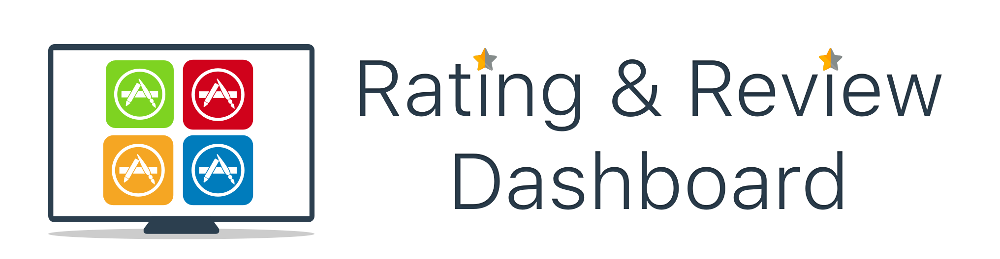
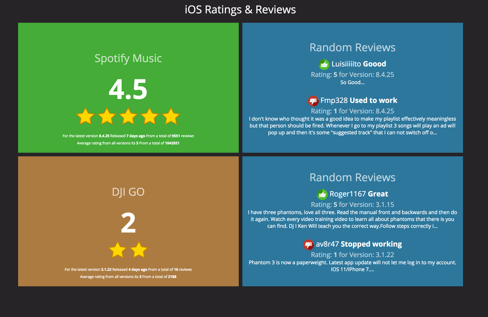

<p align="center">
  
</p>

The App Store Rating Dashboard was build using [Dashing](http://shopify.github.com/dashing). Its a great way to show the current rating and reviews of your Apps in a TV among the team.

## Example



:rocket: Getting started
-------
Run `bundle install`.

Edit `config/config.json` with the configuration for your apps. The App ID can normally be found in iTunes connect

```
{
  "dashboardTitle": "iOS Ratings & Reviews",
  "iTunesAppInfoLookUpUrl": "http://itunes.apple.com/lookup",
  "iTunesCustomerReviewsUrl": "http://itunes.apple.com/rss/customerreviews",
  "app_ids": [
    "324684580",
    "943780750"
  ]
}
```

Run `dashing start`.

Runs at `http://localhost:3030` by default.

Run `dashing start -d -p 3031` to run it as a daemon and to specify the port. You can stop the daemon with `dashing stop`.

See https://github.com/Shopify/dashing/wiki for more details.

:whale: Docker support
-------
You can spin up a Docker container with the dashboard by running:

`docker-compose up -d`

The application will be ready at `http://localhost:3030` (Linux) or at `http://<DOCKER_HOST_IP>:3030` (Windows/OS X).

You can also build the image and run a container separately, but [Docker Compose](https://docs.docker.com/compose/install/) makes this process much simpler.

:tv: Using
----
You can use a ChromeCast to present the dashboard in a TV and use an extension like [Rotisserie](https://chrome.google.com/webstore/detail/rotisserie-url-rotator/iljemanjjfjlglhkmojkmfbpphiaheja?hl=en) to rotate between other dashboards.

:100: Contributing
-----
Pull requests are very welcome. Run the tests with `rspec`.

:alien: Author
------
Chris Jimenez - http://code.chrisjimenez.net

:beer: Donate
------
If you want to buy me a beer, you can donate to my coin addresses below:
#### BTC
1BeGBew4CBdLgUSmvoyiU1LrM99GpkXgkj
#### ETH
0xa59a3793E3Cb5f3B1AdE6887783D225EDf67192d
#### LTC
Ld6FB3Tqjf6B8iz9Gn9sMr7BnowAjSUXaV

## License
`App Store Rating Dashboard` is released under the MIT license. See [LICENSE](https://github.com/pixel16/appstore-rating-dashboard/blob/master/LICENSE) for details.